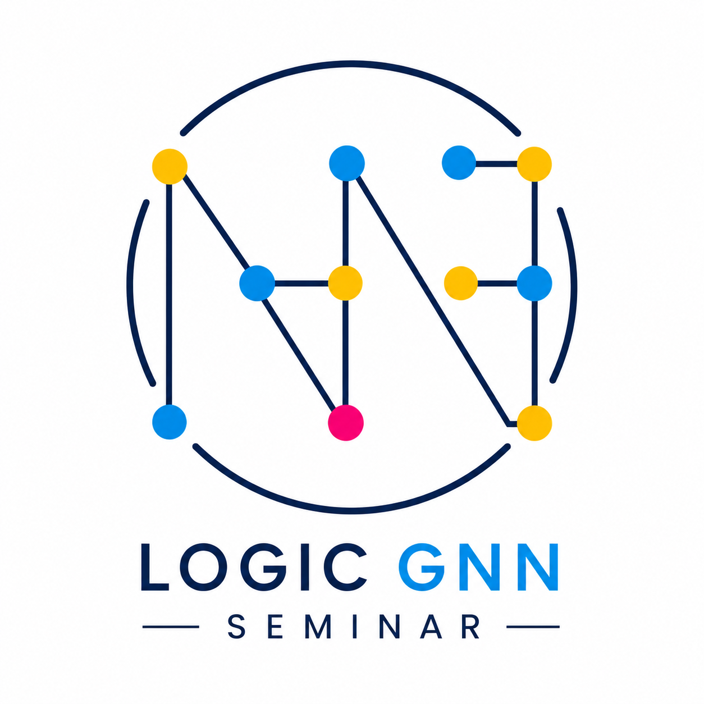

# Logic GNN Seminar

  

Welcome to the **Logic GNN Seminar Series** — a research seminar focused on the **logical expressiveness of Graph Neural Networks (GNNs)** and related topics at the intersection of:

- Expressive power of GNN architectures
- Verification of GNN models using formal methods
- Logical explainability and interpretability of GNNs
- Rule learning and knowledge discovery with GNN models
- Computational complexity of GNN architectures

The seminar brings together researchers and students interested in understanding the theoretical foundations, limitations, and capabilities of graph representation learning methods.

---

# Schedule

| Date | Speaker | Title | Affiliation |
|---|---|---|---|
| 21/05/2026, 15:30-17:00 UK time | Przemysław Wałęga | Basics of Preservation and Łoś-Tarski Theorem | Queen Mary University of London |
| 04/06/2026, 15:30-17:00 UK time | Przemysław Wałęga | Preservation Theorems in Finite | Queen Mary University of London |
| 18/06/2026, 15:30-17:00 UK time | Przemysław Wałęga | Preservation Theorems for Graph Neural Networks | Queen Mary University of London |

---

# Organization
This  Seminar is a part of the [“Formal Methods and AI” theme](https://www.seresearch.qmul.ac.uk/cfcs/research/) of the Centre for Fundamentals of AI and Computational Theory at the Queen Mary University of London.

### Organizers
- Przemysław Wałęga (lead)
- Eva Feng
- Alexander Rinsche
- Stanislaw Hauke
- Xiaxia Wang

---

# Contact

Interested in joining? Contact us under 📧 [lognn.seminars@gmail.com](mailto:lognn.seminars@gmail.com) or sign up to our [mailing list](https://groups.google.com/u/2/g/logic-gnn-seminar)!
